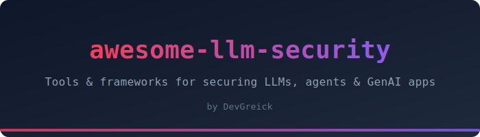

<div align="center">




A curated list of tools, frameworks, and resources for securing LLMs, AI agents, and GenAI applications.

[](https://awesome.re)
[](CONTRIBUTING.md)
[](LICENSE)

Curated by [DevGreick](https://github.com/DevGreick)

</div>

---

## Why This List?

LLM security is moving fastm new tools, attack vectors, and frameworks appear every week. This list is **practitioner-first** organized by what you're trying to do, with pricing, maturity badges, opinionated stacks, and getting started paths, every entry is something you can install and run today.


## Contents

- [Red Teaming & Offensive](#red-teaming--offensive)
  - [LLM Vulnerability Scanners](#llm-vulnerability-scanners)
  - [Jailbreak Frameworks](#jailbreak-frameworks)
  - [Prompt Injection Testing](#prompt-injection-testing)
  - [Benchmarks & Datasets](#benchmarks--datasets)
- [Guardrails & Defense](#guardrails--defense)
  - [Input/Output Scanners](#inputoutput-scanners)
  - [Programmable Guardrails](#programmable-guardrails)
  - [PII & Data Leakage Prevention](#pii--data-leakage-prevention)
- [Agent & MCP Security](#agent--mcp-security)
  - [Agent Scanners](#agent-scanners)
  - [MCP Security](#mcp-security)
  - [Sandboxing & Isolation](#sandboxing--isolation)
- [Model Security](#model-security)
  - [Model Scanning](#model-scanning)
  - [Adversarial Robustness](#adversarial-robustness)
  - [Watermarking & Detection](#watermarking--detection)
- [RAG Security](#rag-security)
- [LLM-Powered Security Tools](#llm-powered-security-tools)
  - [Reverse Engineering](#reverse-engineering)
  - [Vulnerability Detection](#vulnerability-detection)
  - [Pentesting Assistants](#pentesting-assistants)
- [Commercial Platforms](#commercial-platforms)
- [Frameworks & Standards](#frameworks--standards)
- [Learning & CTF](#learning--ctf)
- [Recommended Stacks](#recommended-stacks)
- [Contributing](#contributing)

---

> **Legend**
>
> | Badge | Meaning |
> |-------|---------|
> | 🟢 | Production-ready / Mature |
> | 🟡 | Beta / Active development |
> | 🔴 | Alpha / Experimental |
> | ⭐ | Tested by [DevGreick](https://github.com/DevGreick) |
> | 🆓 | Free / Open Source |
> | 💎 | Freemium (free tier + paid features) |
> | 💰 | Paid / Commercial |

---

## Red Teaming & Offensive

### LLM Vulnerability Scanners

| Name | Description | Maturity | Pricing | Link |
|------|-------------|----------|---------|------|
| [Augustus](https://github.com/a16z-infra/augustus) | LLM security testing with 190+ probes and 28 providers in Go | 🟡 | 🆓 | [GitHub](https://github.com/a16z-infra/augustus) |
| [Garak](https://github.com/NVIDIA/garak) | NVIDIA's LLM vulnerability scanner with 50+ probe families | 🟢 | 🆓 | [GitHub](https://github.com/NVIDIA/garak) |
| [Giskard](https://github.com/Giskard-AI/giskard) | Testing and evaluation framework for ML and LLM models | 🟢 | 💎 | [GitHub](https://github.com/Giskard-AI/giskard) |
| [Promptfoo](https://www.promptfoo.dev/) | Red teaming, pentesting, and vuln scanning for LLMs. Now part of OpenAI | 🟢 | 💎 | [GitHub](https://github.com/promptfoo/promptfoo) |
| [PyRIT](https://github.com/Azure/PyRIT) | Microsoft's Python Risk Identification Tool for generative AI | 🟢 | 🆓 | [GitHub](https://github.com/Azure/PyRIT) |

### Jailbreak Frameworks

| Name | Description | Maturity | Pricing | Link |
|------|-------------|----------|---------|------|
| [EasyJailbreak](https://github.com/EasyJailbreak/EasyJailbreak) | Python framework to generate adversarial jailbreak prompts | 🟢 | 🆓 | [GitHub](https://github.com/EasyJailbreak/EasyJailbreak) |
| [FuzzyAI](https://github.com/cyberark/FuzzyAI) | CyberArk's automated LLM fuzzer with genetic algorithm mutations | 🟡 | 🆓 | [GitHub](https://github.com/cyberark/FuzzyAI) |
| [GPTFuzzer](https://github.com/sherdencooper/GPTFuzz) | Auto-generated jailbreak prompts via fuzzing | 🟢 | 🆓 | [GitHub](https://github.com/sherdencooper/GPTFuzz) |
| [JailbreakBench](https://github.com/JailbreakBench/jailbreakbench) | Open robustness benchmark for jailbreaking (NeurIPS 2024) | 🟢 | 🆓 | [GitHub](https://github.com/JailbreakBench/jailbreakbench) |
| [Purple Llama](https://github.com/meta-llama/PurpleLlama) | Meta's tools for assessing and improving LLM safety | 🟢 | 🆓 | [GitHub](https://github.com/meta-llama/PurpleLlama) |

### Prompt Injection Testing

| Name | Description | Maturity | Pricing | Link |
|------|-------------|----------|---------|------|
| [HouYi](https://github.com/LLMSecurity/HouYi) | Automated prompt injection for LLM-integrated apps | 🟡 | 🆓 | [GitHub](https://github.com/LLMSecurity/HouYi) |
| [LLMFuzzer](https://github.com/mnns/LLMFuzzer) | Fuzzing framework for LLM API integrations | 🟡 | 🆓 | [GitHub](https://github.com/mnns/LLMFuzzer) |
| [Open-Prompt-Injection](https://github.com/liu00222/Open-Prompt-Injection) | Benchmark for prompt injection attacks and defenses | 🟢 | 🆓 | [GitHub](https://github.com/liu00222/Open-Prompt-Injection) |
| [Promptmap](https://github.com/utkusen/promptmap) | Prompt injection scanner for custom LLM apps | 🟡 | 🆓 | [GitHub](https://github.com/utkusen/promptmap) |
| [ps-fuzz](https://github.com/prompt-security/ps-fuzz) | System prompt hardening and testing tool | 🟡 | 🆓 | [GitHub](https://github.com/prompt-security/ps-fuzz) |

### Benchmarks & Datasets

| Name | Description | Maturity | Pricing | Link |
|------|-------------|----------|---------|------|
| [AgentDojo](https://github.com/ethz-spylab/agentdojo) | Dynamic environment to evaluate attacks/defenses for LLM agents | 🟢 | 🆓 | [GitHub](https://github.com/ethz-spylab/agentdojo) |
| [CyberSecEval](https://github.com/meta-llama/PurpleLlama/tree/main/CyberSecEval) | Meta's benchmark for LLM cybersecurity risk assessment | 🟢 | 🆓 | [GitHub](https://github.com/meta-llama/PurpleLlama) |
| [HarmBench](https://github.com/centerforaisafety/HarmBench) | Standardized evaluation for automated red teaming | 🟢 | 🆓 | [GitHub](https://github.com/centerforaisafety/HarmBench) |

---

## Guardrails & Defense

### Input/Output Scanners

| Name | Description | Maturity | Pricing | Link |
|------|-------------|----------|---------|------|
| [LLM Guard](https://protectai.com/llm-guard) | 35 scanners for prompt injection, PII, toxicity, and secrets | 🟢 | 🆓 | [GitHub](https://github.com/protectai/llm-guard) |
| [Rebuff](https://github.com/protectai/rebuff) | Self-hardening prompt injection detector with canary tokens | 🟡 | 🆓 | [GitHub](https://github.com/protectai/rebuff) |
| [TrustGate](https://github.com/trustgate-ai/trustgate) | Generative Application Firewall (GAF) for GenAI apps | 🟡 | 🆓 | [GitHub](https://github.com/trustgate-ai/trustgate) |
| [Vigil](https://github.com/deadbits/vigil-llm) | Detect prompt injections and jailbreaks via heuristics + YARA | 🟡 | 🆓 | [GitHub](https://github.com/deadbits/vigil-llm) |

### Programmable Guardrails

| Name | Description | Maturity | Pricing | Link |
|------|-------------|----------|---------|------|
| [Guardrails AI](https://www.guardrailsai.com/) | Validation framework for LLM outputs with custom validators | 🟢 | 💎 | [GitHub](https://github.com/guardrails-ai/guardrails) |
| [NeMo Guardrails](https://github.com/NVIDIA/NeMo-Guardrails) | NVIDIA's programmable rails for LLM conversational systems | 🟢 | 🆓 | [GitHub](https://github.com/NVIDIA/NeMo-Guardrails) |

### PII & Data Leakage Prevention

| Name | Description | Maturity | Pricing | Link |
|------|-------------|----------|---------|------|
| [Presidio](https://github.com/microsoft/presidio) | Microsoft's context-aware PII anonymization engine | 🟢 | 🆓 | [GitHub](https://github.com/microsoft/presidio) |
| [Safe Zone](https://github.com/nicholasgcoles/safe-zone) | Open source PII detection and guardrails engine for LLMs | 🟡 | 🆓 | [GitHub](https://github.com/nicholasgcoles/safe-zone) |

---

## Agent & MCP Security

### Agent Scanners

| Name | Description | Maturity | Pricing | Link |
|------|-------------|----------|---------|------|
| [Aegis](https://github.com/sahil-sagwekar2652/aegis) | Open source EDR for AI agents: process, file, network monitoring | 🟡 | 🆓 | [GitHub](https://github.com/sahil-sagwekar2652/aegis) |
| [Agentic Radar](https://github.com/splx-ai/agentic-radar) | CLI security scanner for agentic AI workflows | 🟡 | 🆓 | [GitHub](https://github.com/splx-ai/agentic-radar) |

### MCP Security

| Name | Description | Maturity | Pricing | Link |
|------|-------------|----------|---------|------|
| [MCP Guardian](https://github.com/eqtylab/mcp-guardian) | Access control and activity monitoring for MCP servers | 🟡 | 🆓 | [GitHub](https://github.com/eqtylab/mcp-guardian) |
| [MCP Security Checklist](https://github.com/nicholasgcoles/MCP-Security-Checklist) | SlowMist's comprehensive checklist for MCP ecosystem | 🟢 | 🆓 | [GitHub](https://github.com/nicholasgcoles/MCP-Security-Checklist) |
| [Secure MCP Gateway](https://github.com/nicholasgcoles/secure-mcp-gateway) | Security wrapper with auth and guardrail enforcement for MCP | 🟡 | 🆓 | [GitHub](https://github.com/nicholasgcoles/secure-mcp-gateway) |

### Sandboxing & Isolation

| Name | Description | Maturity | Pricing | Link |
|------|-------------|----------|---------|------|
| [E2B](https://e2b.dev/) | Sandboxed cloud environments for AI agents and code execution | 🟢 | 💎 | [GitHub](https://github.com/e2b-dev/e2b) |
| [ShellWard](https://github.com/nicholasgcoles/shellward) | AI Agent Security Middleware with 8-layer defense, zero deps | 🟡 | 🆓 | [GitHub](https://github.com/nicholasgcoles/shellward) |

---

## Model Security

### Model Scanning

| Name | Description | Maturity | Pricing | Link |
|------|-------------|----------|---------|------|
| [ModelScan](https://github.com/protectai/modelscan) | Scan serialized ML model files for malicious code and backdoors | 🟢 | 🆓 | [GitHub](https://github.com/protectai/modelscan) |
| [ai-bom](https://github.com/nicholasgcoles/ai-bom) | AI Bill of Materials: discover agents, models, and APIs in your infra | 🟡 | 🆓 | [GitHub](https://github.com/nicholasgcoles/ai-bom) |

### Adversarial Robustness

| Name | Description | Maturity | Pricing | Link |
|------|-------------|----------|---------|------|
| [ART](https://github.com/Trusted-AI/adversarial-robustness-toolbox) | IBM's toolbox for evasion, poisoning, extraction, and inference | 🟢 | 🆓 | [GitHub](https://github.com/Trusted-AI/adversarial-robustness-toolbox) |
| [Counterfit](https://github.com/Azure/counterfit) | Microsoft's CLI for assessing ML model security | 🟡 | 🆓 | [GitHub](https://github.com/Azure/counterfit) |
| [Foolbox](https://github.com/bethgelab/foolbox) | Adversarial attacks against neural networks in PyTorch/TF/JAX | 🟢 | 🆓 | [GitHub](https://github.com/bethgelab/foolbox) |
| [TextAttack](https://github.com/QData/TextAttack) | Adversarial attacks and data augmentation for NLP | 🟢 | 🆓 | [GitHub](https://github.com/QData/TextAttack) |

### Watermarking & Detection

| Name | Description | Maturity | Pricing | Link |
|------|-------------|----------|---------|------|
| [GPTZero](https://gptzero.me/) | AI content detection platform | 🟢 | 💎 | [Website](https://gptzero.me/) |
| [MarkMyWords](https://github.com/julien-c/MarkMyWords) | Open source toolkit for LLM watermarking | 🟡 | 🆓 | [GitHub](https://github.com/julien-c/MarkMyWords) |

---

## RAG Security

| Name | Description | Maturity | Pricing | Link |
|------|-------------|----------|---------|------|
| [LangKit](https://github.com/whylabs/langkit) | Open source toolkit for LLM/RAG observability and safety monitoring | 🟢 | 💎 | [GitHub](https://github.com/whylabs/langkit) |
| [Plexiglass](https://github.com/safellm-2024/plexiglass) | Security toolbox for testing and safeguarding LLMs and RAG | 🟡 | 🆓 | [GitHub](https://github.com/safellm-2024/plexiglass) |

---

## LLM-Powered Security Tools

### Reverse Engineering

| Name | Description | Maturity | Pricing | Link |
|------|-------------|----------|---------|------|
| [G-3PO](https://github.com/tenable/G-3PO) | Tenable's AI assistant for analyzing decompiled code in Ghidra | 🟢 | 💎 | [GitHub](https://github.com/tenable/G-3PO) |
| [Gepetto](https://github.com/JusticeRage/Gepetto) | IDA Pro plugin that queries GPT for explanatory comments | 🟢 | 💎 | [GitHub](https://github.com/JusticeRage/Gepetto) |

### Vulnerability Detection

| Name | Description | Maturity | Pricing | Link |
|------|-------------|----------|---------|------|
| [ai for Pwndbg](https://github.com/tenable/pwndbg-ai) | AI debugging sidekick as a Pwndbg command | 🟡 | 🆓 | [GitHub](https://github.com/tenable/pwndbg-ai) |
| [HackingBuddyGPT](https://github.com/ipa-lab/hackingBuddyGPT) | Automated pentester using LLMs with benchmark dataset | 🟡 | 💎 | [GitHub](https://github.com/ipa-lab/hackingBuddyGPT) |

### Pentesting Assistants

| Name | Description | Maturity | Pricing | Link |
|------|-------------|----------|---------|------|
| [PentestGPT](https://github.com/GreyDGL/PentestGPT) | GPT-powered automated penetration testing tool | 🟡 | 💎 | [GitHub](https://github.com/GreyDGL/PentestGPT) |

---

## Commercial Platforms

Enterprise-grade platforms for teams that need managed LLM security at scale.

| Name | Description | Maturity | Pricing | Link |
|------|-------------|----------|---------|------|
| [Calypso AI](https://calypsoai.com/) | Real-time AI security platform with policy enforcement and monitoring | 🟢 | 💰 | [Website](https://calypsoai.com/) |
| [HiddenLayer](https://hiddenlayer.com/) | AI security platform for model protection and threat detection | 🟢 | 💰 | [Website](https://hiddenlayer.com/) |
| [Lakera](https://www.lakera.ai/) | Real-time AI security API with prompt injection firewall | 🟢 | 💰 | [Website](https://www.lakera.ai/) |
| [Lasso Security](https://www.lasso.security/) | LLM security for enterprise with data leakage prevention | 🟢 | 💰 | [Website](https://www.lasso.security/) |
| [Prompt Security](https://www.prompt.security/) | GenAI security platform protecting inputs, outputs, and model access | 🟢 | 💰 | [Website](https://www.prompt.security/) |
| [Robust Intelligence](https://www.robustintelligence.com/) | AI firewall and continuous validation for production models | 🟢 | 💰 | [Website](https://www.robustintelligence.com/) |

---

## Frameworks & Standards

| Name | Description | Link |
|------|-------------|------|
| [EU AI Act](https://artificialintelligenceact.eu/) | European Union AI regulation | [Website](https://artificialintelligenceact.eu/) |
| [Google SAIF](https://safety.google/cybersecurity-advancements/saif/) | Secure AI Framework by Google | [Website](https://safety.google/cybersecurity-advancements/saif/) |
| [MITRE ATLAS](https://atlas.mitre.org/) | Adversarial Threat Landscape for AI Systems | [Website](https://atlas.mitre.org/) |
| [NIST AI RMF](https://www.nist.gov/artificial-intelligence) | AI Risk Management Framework | [Website](https://www.nist.gov/artificial-intelligence) |
| [OWASP Top 10 for Agentic AI 2026](https://genai.owasp.org/) | First standard for autonomous AI agent risks (ASI01-ASI10) | [Website](https://genai.owasp.org/) |
| [OWASP Top 10 for LLM 2025](https://genai.owasp.org/) | Industry standard for LLM application risks (v2.0) | [Website](https://genai.owasp.org/) |

---

## Learning & CTF

| Name | Description | Pricing | Link |
|------|-------------|---------|------|
| [0din GenAI Bug Bounty](https://0din.ai/) | Mozilla's bug bounty program for GenAI model flaws | 🆓 | [Website](https://0din.ai/) |
| [Damn Vulnerable LLM App](https://github.com/WithSecureLabs/damn-vulnerable-llm-app) | Intentionally vulnerable LLM app for training | 🆓 | [GitHub](https://github.com/WithSecureLabs/damn-vulnerable-llm-app) |
| [Gandalf](https://gandalf.lakera.ai/) | Prompt injection CTF by Lakera | 🆓 | [Website](https://gandalf.lakera.ai/) |
| [HackAPrompt](https://www.aicrowd.com/challenges/hackaprompt-2023) | Prompt hacking competition | 🆓 | [Website](https://www.aicrowd.com/challenges/hackaprompt-2023) |
| [LLMSecurityGuide](https://github.com/requie/LLMSecurityGuide) | Comprehensive guide covering OWASP LLM 2025 + Agentic 2026 | 🆓 | [GitHub](https://github.com/requie/LLMSecurityGuide) |
| [Prompt Airlines](https://promptairlines.com/) | Hands-on GenAI security challenges | 🆓 | [Website](https://promptairlines.com/) |

---

## Recommended Stacks

### Secure Your LLM App (Minimum Viable Security)

```
1. LLM Guard       → Input/output scanning (prompt injection, PII, secrets)
2. NeMo Guardrails → Programmable conversation rails
3. Gitleaks        → Prevent API keys in prompts/code
4. Promptfoo       → Red team before deploy
```

### Full Red Team Pipeline

```
1. Garak    → Broad vulnerability scan (50+ probes)
2. PyRIT    → Multi-turn adversarial orchestration
3. FuzzyAI  → Jailbreak fuzzing with mutations
4. Promptfoo→ Regression testing in CI/CD
5. AgentDojo→ Agent-specific attack evaluation
```

### Agent/MCP Hardening

```
1. Agentic Radar → Scan agentic workflows
2. MCP Guardian  → Access control for MCP servers
3. E2B           → Sandbox code execution
4. LLM Guard     → Filter agent I/O
5. ModelScan     → Scan model files before loading
```

---

## Contributing

Contributions are welcome! Please read the [Contributing Guide](CONTRIBUTING.md) before submitting a PR.

## License

[MIT](LICENSE)
